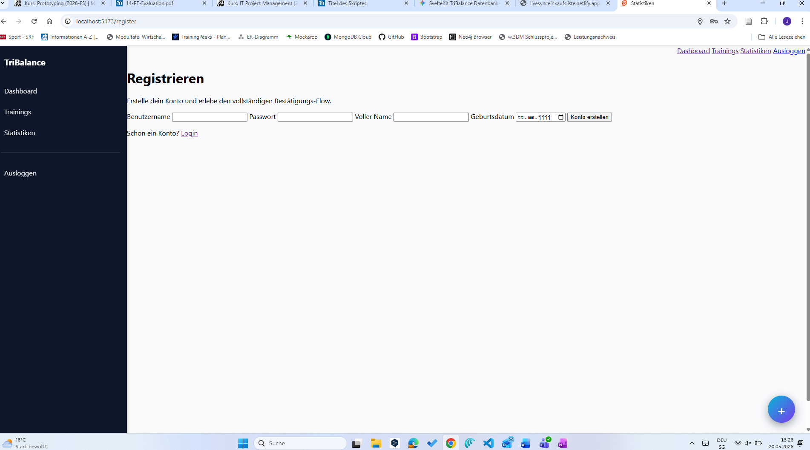
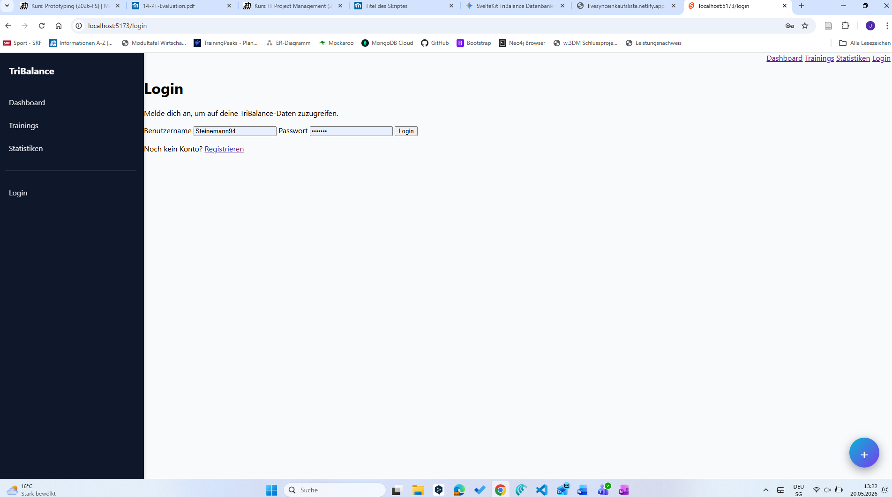
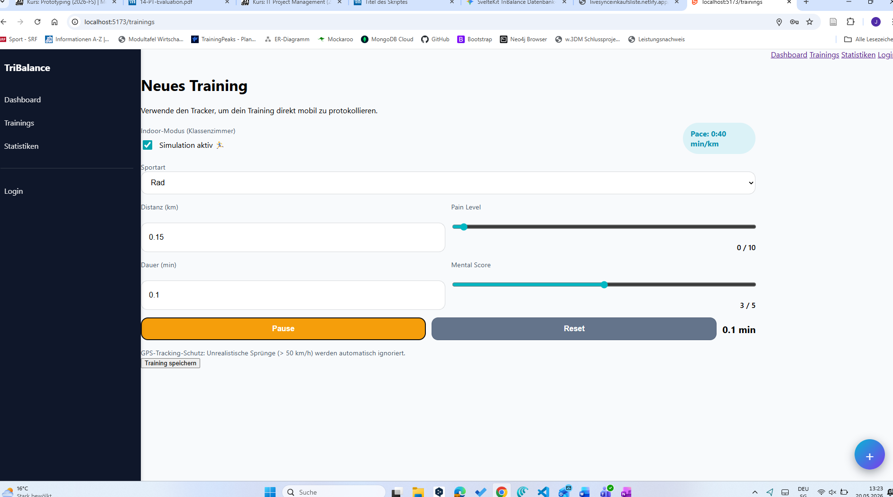
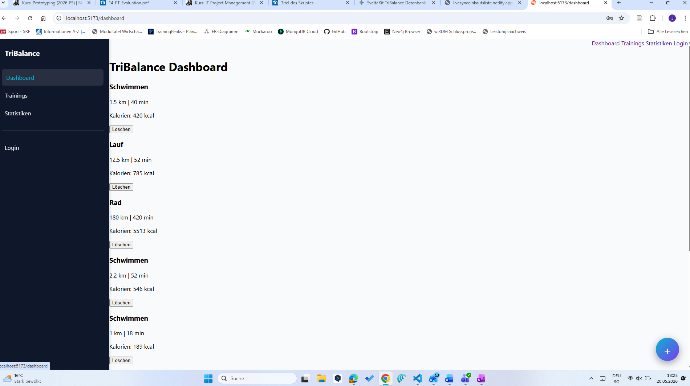
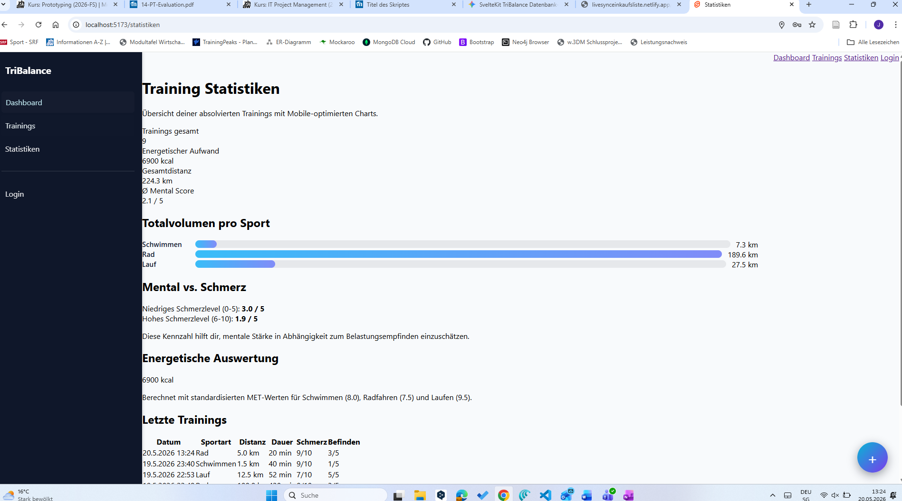
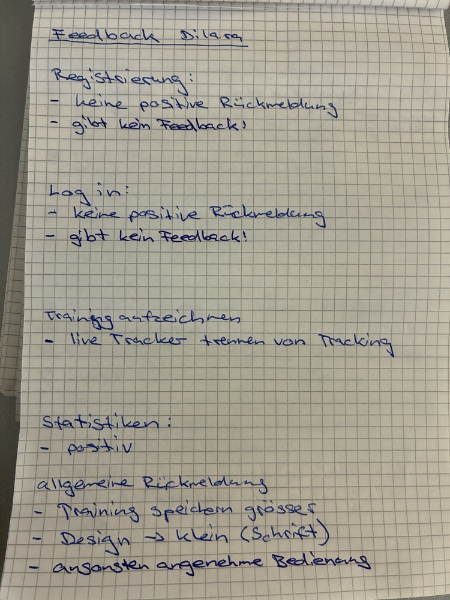
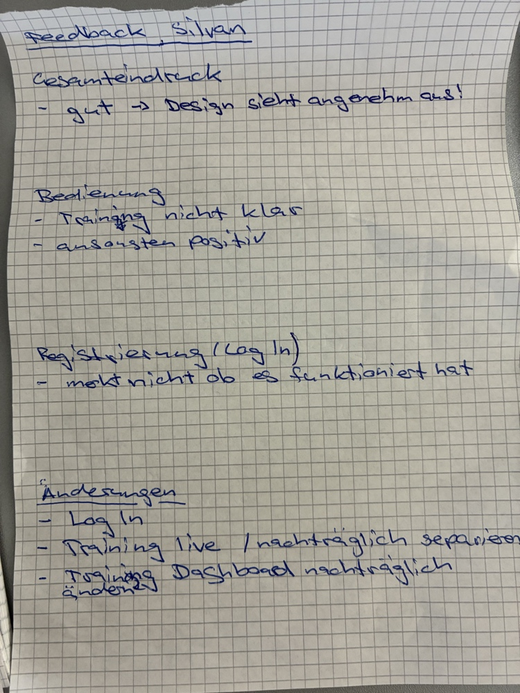
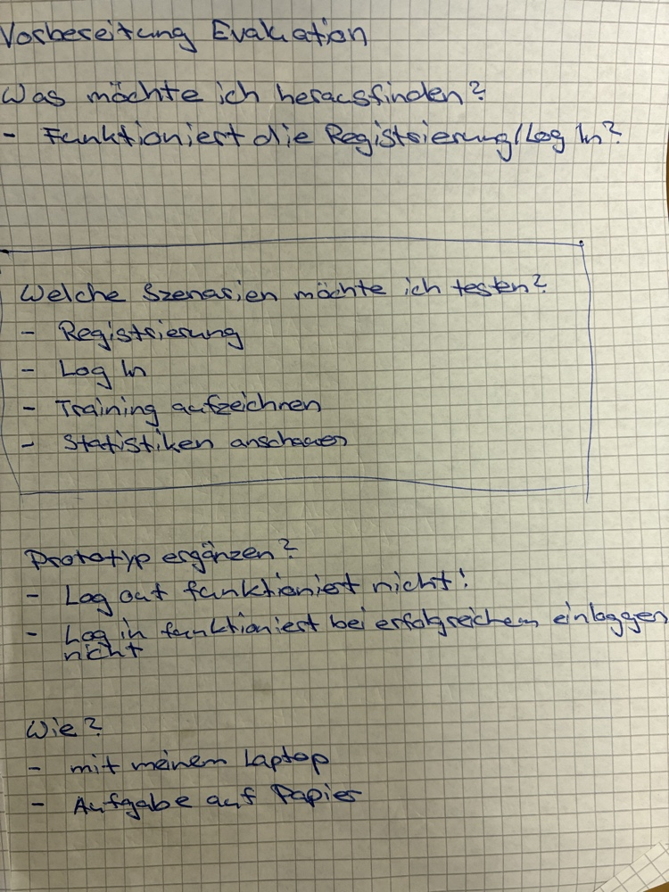

# Projektdokumentation - TriBalance

## Inhaltsverzeichnis

1. [Ausgangslage](#1-ausgangslage)
2. [Lösungsidee](#2-lösungsidee)
3. [Vorgehen & Artefakte](#3-vorgehen--artefakte)
    1. [Understand & Define](#31-understand--define)
    2. [Sketch](#32-sketch)
    3. [Decide](#33-decide)
    4. [Prototype](#34-prototype)
        1. [Entwurf (Design)](#341-entwurf-design)
        2. [Umsetzung (Technik)](#342-umsetzung-technik)
    5. [Validate](#35-validate)
4. [Erweiterungen](#4-erweiterungen)
5. [Projektorganisation](#5-projektorganisation)
6. [KI-Deklaration](#6-ki-deklaration)
7. [Anhang [Optional]](#7-anhang-optional)

## 1. Ausgangslage
* **Problem:** Triathleten konzentrieren sich im Training oft rein auf physische Metriken wie Distanz, Herzfrequenz und Uhrzeit. Die mentale Verfassung, das Stresslevel und das subjektive Schmerzempfinden werden im Trainingsalltag vernachlässigt. Diese Disbalance gefährdet langfristig die Gesundheit, begünstigt Übertraining und blockiert den sportlichen Erfolg.
* **Ziele:** Entwicklung eines interaktiven Multi-Sport-Logbuchs, das physische Leistungsdaten (Dauer, Distanz, Kalorien) nahtlos mit einem "Mental-Strength-Log" verknüpft, um Zusammenhänge zwischen Psyche und Leistung aufzuzeigen.
* **Primäre Zielgruppe:** Ambitionierte Triathleten (Schwimmen, Radfahren, Laufen), die eine ganzheitliche Übersicht über ihre physische und psychische Belastung suchen.

## 2. Lösungsidee
* **Kernfunktionalität:**
  * Erfassung von Trainingseinheiten via interaktivem Echtzeit-Formular (Sportart, Distanz, Dauer).
  * Integriertes Tracking der psychischen Verfassung (Mental Score) und des Schmerz-Empfindens (Pain Level).
  * Zentrales Dashboard zur Visualisierung physischer Statistiken gepaart mit mentalen Trends und einer tiefergehenden, dedizierten Detailansicht für jede aufgezeichnete Einheit.
  * Historische Übersicht zur Reflexion vergangener Belastungsphasen inklusive direkter, kompromissloser In-Place-Datenbearbeitung (CRUD).

## 3. Vorgehen & Artefakte

### 3.1 Understand & Define
* **Wesentliche Erkenntnisse:** Es fehlt am Markt ein zugängliches Tool, das physische Leistung und psychische Belastbarkeit einfach miteinander verknüpft, ohne den User nach dem Sport mit komplexen medizinischen Fragebögen zu überlasten.
* **How-Might-We-Frage:** Wie könnten wir Triathleten helfen, den Zusammenhang zwischen ihrer mentalen Stärke und ihrem physischen Training im Alltag unkompliziert sichtbar zu machen?

### 3.2 Sketch
* **Variantenüberblick:** Erstellung von 8 Konzeptvarianten für das zentrale Log-Feature mittels der *Crazy 8s* Methodik.
* **Skizzen:** Der Fokus lag auf unterschiedlichen Interaktionsansätzen wie einem "Kalender-Fokus", einem schnellen "Emoji-Tagebuch" oder einer geführten "Chat-Eingabe".

### 3.3 Decide
* **Gewählte Variante & Begründung:** Eine Kombination aus einer strukturierten Kalenderansicht für historische Daten und einem zentralen, direkt geladenen Dashboard. Diese Kombination bietet die beste zeitliche Übersicht bei gleichzeitig schneller visueller Rückmeldung über den aktuellen Zustand.
* **Mockup:** Erstellt in Figma unter konsequenter Einhaltung eines *Mobile-First-Ansatzes*, da Triathleten ihre Einheiten oft unmittelbar nach dem Training noch unterwegs oder in der Umkleidekabine loggen möchten.

### 3.4 Prototype

#### 3.4.1. Entwurf (Design)
* **Informationsarchitektur:** Um eine klare Trennung zwischen Datenerfassung und Datenvisualisierung zu schaffen, wurde das ursprüngliche Single-Page-Design in ein Multi-Route-System überführt:
  * `/trainings` (Write): Dedizierte Route für die Trainingserfassung via Echtzeit-Tracker.
  * `/dashboard` (Read): Zentrale Übersicht, die historische Einträge aggregiert darstellt.
  * `/dashboard/[id]` (Detail-Read): Eine isolierte, zukunftssichere Detailansicht zur vollständigen Inspektion einzelner Einheiten (inkl. erfasster Textnotizen).
  * `/statistiken` (Analytics): Übergreifende mathematische Auswertung von mentalen und physischen Parametern.
* **Globales Layout und Navigation (`+layout.svelte`):** Das Layout bildet das funktionale Gerüst der Applikation. Es wurde primär nach Desktop-First-Prinzipien entwickelt, bietet jedoch durch reaktive CSS-Klassen eine vollständige mobile Adaption. 
* **Designentscheidungen:** * **Sidebar-Logik:** Auf Viewports > 1024px ist eine 280px breite Sidebar fixiert. Dies minimiert die kognitive Last, da Navigationselemente stets sichtbar sind.
  * **Unified Design System:** Um ein perfekt homogenes Benutzererlebnis zu garantieren, wurde die gesamte Applikation plattformübergreifend auf eine standardisierte, äußere Container-Klasse (`.page-wrapper`) refactored. Dies vereinheitlicht Paddings und Breitenbeschränkungen (`max-width`) auf allen Views (Dashboard, Login, Registrierung, Statistiken).
  * **Mobile Adaption:** Über Tailwind Media-Queries bricht die Sidebar auf Smartphones in einen Bottom-Drawer um (*Thumb-Zone*-Design), was die Einhandbedienung erleichtert.
  * **Floating Action Button (FAB):** Ein zentraler "+"-Button dient auf Mobilgeräten als primärer Call-to-Action (CTA), um die Interaktionskosten beim Starten eines Trainings zu minimieren.
  * **Slider-Eingabe:** Nutzung eines numerischen Sliders (1-5) für den Mental-Fokus zur Senkung der Hürde bei der Dateneingabe.
  * **Mathematische Skalen-Definitionen:** Zur Vermeidung sportwissenschaftlicher Verzerrungen wurden sämtliche Skalen-Untergrenzen hart von 0 auf 1 angehoben. Der Mental Score operiert somit strikt im Bereich 1–5 (Anzeige: Y / 5), während das Schmerzlevel im Bereich 1–10 (Anzeige: X / 10) abgebildet wird.

#### 3.4.2. Umsetzung (Technik)
* **Technologie-Stack:** SvelteKit (HTML/CSS/JavaScript), Tailwind CSS (Layout & Design), MongoDB (Datenbank-Persistenz via offiziellen `mongodb`-Treiber).
* **Die Tracker-Komponente (`Tracker.svelte`):** Kombiniert zeitliche Erfassung mit räumlicher Logik.
  * **Echtzeit-Stoppuhr:** Über ein `setInterval` implementiert, das die Dauer berechnet und über Svelte-Reaktivität sofort im UI spiegelt.
  * **Geolocation & Haversine-Formel:** Zur Berechnung der zurückgelegten Distanz ohne externe API-Kosten nutzt die Komponente die native Web Geolocation API des Browsers. Die Distanz zwischen zwei GPS-Koordinatenpunkten wird über die Haversine-Formel berechnet:
    $$d = 2r \arcsin\left(\sqrt{\sin^2\left(\frac{\phi_2-\phi_1}{2}\right) + \cos(\phi_1)\cos(\phi_2)\sin^2\left(\frac{\lambda_2-\lambda_1}{2}\right)}\right)$$
  * **SSR-Sicherheit:** Da die `navigator.geolocation`-API im Server-Side-Rendering von SvelteKit nicht existiert, wurde die gesamte Sensor-Logik in den `onMount`-Lifecycle-Hook gekapselt, um Server-Abstürze zu verhindern.
  * **Robustheit:** Ein eingebauter Glitch-Filter ignoriert fehlerhafte GPS-Sprünge, falls die Distanz zwischen zwei Messpunkten unrealistisch hoch ausfällt.
* **Migration auf Svelte 5 (Runes):** Die Reaktivitäts-Logik wurde von Svelte 4 (`export let`, `$:`) vollständig auf die modernen Svelte 5 Runes (`$state`, `$derived`, `$props`) refactored. Dies führt zu einer performanteren Synchronisation zwischen den GPS-Sensordaten und der Benutzeroberfläche.
* **Analytics & Datenfluss:** Daten werden von der `Tracker.svelte`-Komponente via Custom Events an das Page-Level-Formular (`+page.svelte`) übergeben. Von dort erfolgt die Übermittlung an die serverseitige Logik (`+page.server.js`) via SvelteKit Form Actions. Unter Integration der `calories.js` wird bei jedem Speichervorgang automatisch der energetische Aufwand basierend auf MET-Faktoren (Metabolic Equivalent of Task) berechnet.

#### 🛠️ Technische Sanierung & Datenbank-Krimi (Bugfix-Dokumentation)
Während der Entwicklung traten kritische Fehler bei der Anbindung der entfernten MongoDB Atlas Datenbank auf. Die Behebung wurde wie folgt dokumentiert:

1. **Stabilität der Umgebungsvariablen (`src/lib/server/db.js`):**
   * *Problem:* SvelteKit verlor beim Hot-Reloading im Entwicklungsmodus temporär die statische Verbindung zur `.env`-Datei. Dies führte zu `undefined`-Fehlern (`startsWith`) beim Initialisieren des `MongoClient`.
   * *Lösung:* Umstellung vom statischen Import auf das dynamische private SvelteKit-Modul (`import { env } from '$env/dynamic/private'`), um die URI zur Laufzeit jederzeit sicher auszulesen.
2. **Netzwerk- & DNS-Blockaden im Hochschulnetz:**
   * *Problem:* Restriktive Firewalls im Uni-WLAN blockierten die modernen MongoDB `mongodb+srv://` DNS-SRV-Abfragen. Dies führte lokal reproduzierbar zu `ECONNREFUSED`-Verbindungsabbrüchen.
   * *Lösung:* Modifikation der Verbindungs-URI in der `.env` auf den direkten, dedizierten Shard-Cluster-Verbindungsweg über Port `27017`. Dies umgeht den gesperrten DNS-SRV-Lookup vollständig.
3. **Authentifizierung & URL-Konformität:**
   * *Problem:* Ein Sonderzeichen (`!`) im Datenbank-Passwort führte zu einem Parsing-Fehler innerhalb der Verbindungs-URL. Zudem besaß der Standard-Datenbank-User unzureichende Privilegien, was in einem `MongoServerError: bad auth : authentication failed` resultierte.
   * *Lösung:* Erstellung eines neuen, dedizierten Datenbank-Nutzers (`joel`) ohne URL-kritische Sonderzeichen in MongoDB Atlas, ausgestattet mit der expliziten Rolle `Read and write to any database`.
4. **Erweiterung der Datenerfassung:**
   * Implementierung einer serverseitigen SvelteKit Form Action (`src/routes/trainings/+page.server.js`), welche die Formulardaten asynchron via `use:enhance` entgegennimmt.
   * Integration einer strikten serverseitigen Typ-Validierung (Konvertierung von Strings in numerische `Number`-Typen für Distanz, Dauer, Pain-Level und Mental-Score).
   * Erfolgreiche Verknüpfung mit der exportierten `trainings`-Collection aus `db.js` zur persistenten Speicherung in MongoDB Atlas sowie automatische Weiterleitung (`redirect`) auf die `/statistiken`-Route nach erfolgreichem Write-In.
5. **System-Stabilisierung & Authentifizierung:**
   * *Daten-Serialisierung:* Korrektur des Serialisierungsfehlers auf der Statistik-Seite durch explizite Typ-Umwandlung von `ObjectId` zu `String` in `+page.server.js`.
   * *Authentifizierungs-Layer:* Implementierung eines sessionbasierten Auth-Systems mittels `cookies.set` und serverseitigen Redirects. Schutz der Routen (`/trainings`, `/statistiken`) durch Middleware-Session-Validierung.
   * *Mandantentrennung:* Umstellung der Datenbank-Abfragen auf eine explizite `userId`-Filterung (`find({ userId: sessionId })`), um sicherzustellen, dass Benutzer ausschließlich ihre eigenen, persönlichen Trainingsdaten einsehen können.
   * *Layout-Modernisierung:* Abschluss des Refactorings auf Svelte 5 (`$props`), Beseitigung von `legacy_export_invalid`-Konflikten im `+layout.svelte` und finale Konfiguration der Navigation inklusive dynamischem Login/Logout-Status.
6. **Dashboard-Optimierung & CRUD-Ausbau:**
   * Durchführung des Dashboard-Refactorings sowie Umstellung aller Übersichtskarten auf semantische Link-Tags (`<a>`) zur nativen Routen-Weiterleitung zur dedizierten Detailseite (`/trainings/[id]`).
   * Sauberes Abfangen des Event-Bubblings via `onclick|stopPropagation` im Drei-Punkt-Optionenmenü (`⋮`), um unerwünschte Redirects beim Klicken auf Optionen zu verhindern.
   * Einbau eines dynamischen In-Place-Editings direkt auf dem Dashboard via Svelte 5 `$state`-Rune (`editingId`) gekoppelt mit asynchronem Speichern über die native `fetch`-API gegen die Server-Action `?/updateTraining`.
   * Integration einer interaktiven clientseitigen Lösch-Sicherheitsabfrage mittels `confirm()` zum Schutz vor Datenverlust.
7. **Detailansicht & Aggregation:**
   * Behebung des MongoDB-Importpfads in der neuen Server-Load-Funktion (`trainings/[id]/+page.server.js`) und Gewährleistung der sauberen JSON-Serialisierung des abgerufenen Dokument-Objekts.
   * Umstrukturierung der mobilen Tabellenansicht in reaktive, kartenbasierte Flex-Layouts zur Verbesserung der mobilen Usability.
   * Implementierung einer Echtzeit-Berechnung des Schmerzdurchschnitts (`avgPainScore`) via optimierter `$derived.by`-Rune.
   * Erstellung eines vollkommen symmetrischen, mobilen 2-Spalten-Grids mit einer gestreckten fünften Metrik-Karte (`grid-column: span 2;`) zur harmonischen Ausrichtung des Interfaces.

### 3.5 Validate
* **URL der getesteten Version:** [https://jovial-sunshine-66bf68.netlify.app/](https://jovial-sunshine-66bf68.netlify.app/)
* **Ziele der Prüfung:** Testen, ob Triathleten das Koppeln von physischer Dauer und dem subjektiven Mental-Score intuitiv verstehen, ob die restriktiven Pflichtfelder die Datenqualität sichern und ob das UI während der Bewegung (Tracking) fehlerfrei bedienbar bleibt.
* **Vorgehen:** Moderierter Usability-Test (On-site) unter Einsatz eines Laptops und mobilen Testgeräten. Die Testpersonen wurden gebeten, laut zu denken (*Think-Aloud-Methode*).
* **Stichprobe:** 2 Testpersonen aus der sportlichen Zielgruppe (Silvan und Dilara).
* **Aufgaben/Szenarien:** 1. *Szenario 1 (Auth):* Registriere ein neues Konto im System und logge dich erfolgreich ein.
  2. *Szenario 2 (Manual Write):* Erfasse ein vergangenes Training manuell (Sportart, Datum, Dauer, Distanz, Schmerz, Mental).
  3. *Szenario 3 (Live-Tracking):* Starte eine Live-Session, simuliere eine Aktivität, überprüfe die Slider-Erklärungen und beende/speichere die Einheit.
  4. *Szenario 4 (Analytics):* Navigiere zu den Statistiken und lies den aktuellen Fortschritt ab.
* **Kennzahlen & Beobachtungen:**
  * **Erfolgsquote:** 100% aller Kernaufgaben wurden erfolgreich abgeschlossen.
  * **Qualitative Findings (Evidenz):** * *Silvan (Bedienung & Formular):* Bemängelte, dass im mobilen Aufzeichnungsformular durch doppelte Buttons ("Manuell nachtragen") die visuelle Trennung zwischen Live-Modus und manueller Erfassung unklar war.
    * *Silvan & Dilara (Auth):* Nach dem Abschicken von Registrierung und Login fehlte ein klares, visuelles Feedback. Der Nutzer merkt im ersten Moment nicht, ob die Aktion erfolgreich war.
    * *Dilara (UI-Design):* Kritisierte, dass einige Text-Labels auf dem PC etwas zu klein geraten sind. Zudem sollte der "Speichern & beenden"-Button im Live-Modus prominenter sein.
    * *Statistiken:* Wurden von beiden Testern als extrem übersichtlich und visuell gelungen gelobt.

    #### Visuelle Dokumentation der Evaluations-Szenarien
Um die Interaktion der Probanden lückenlos zu dokumentieren, wurden während der Testdurchführung folgende Screenshots der geprüften Systemzustände gesichert:

*Abbildung 4: Probanden-Testing von Szenario 1 – Die Registrierungsmaske vor dem Einbau des Erfolgs-Feedbacks.*

*Abbildung 5: Überprüfung des Authentifizierungsprozesses (Szenario 1) auf dem Testgerät.*

*Abbildung 6: Live-Tracking-Ansicht (Szenario 3) während der simulierten Aktivität der Testpersonen.*

*Abbildung 7: Das zentrale Dashboard unmittelbar nach dem Speichern der Test-Einheit durch den Nutzer.*

*Abbildung 8: Visuelle Überprüfung der statistischen Auswertungen (Szenario 4) durch die Probanden Silvan und Dilara.*

* **Zusammenfassung der Resultate:** Der Prototyp verhält sich in der Datenerfassung stabil. Das Erfassen über Slider verringert die Eingabehürde nach dem Training signifikant. Kritische Schwachstellen lagen primär im mangelnden Systemfeedback (Auth-Bereich) und kleineren UI-Inkonsistenzen im mobilen Erfassungsformular. Sämtliche Mängel wurden unmittelbar im Anschluss korrigiert (siehe Kapitel 4).
* **Abgeleitete Verbesserungen:** Implementierung interaktiver Toast-Erfolgsmeldungen für Auth-Prozesse, optische Vergrösserung der interaktiven CTA-Buttons, vollständige visuelle Entkopplung der manuellen Erfassungsmaske sowie die Integration eines Sicherheitsnetzes zum Verwerfen von Sessions.

## 4. Erweiterungen
> **Hinweis:** Die folgenden Features wurden als direkte Qualitäts- und Usability-Sprünge über den Mindestumfang hinaus realisiert.

### 4.1 Automatisches Live-GPS-Tracking & Abbruch-Sicherheitsnetz
* **Beschreibung & Nutzen:** Vollautomatische Ermittlung der Trainingsdistanz während des Laufs über den GPS-Sensor des Smartphones (HTML5 Geolocation API). Verhindert manuelle Fehleingaben. Zudem wurde ein roter Abbruch-Button hinzugefügt, damit versehentlich gestartete Einheiten verworfen werden können, ohne die MongoDB zu vermüllen.
* **Wo umgesetzt:** * *Frontend (`src/routes/trainings/+page.svelte`):* Tracking-Logik via `navigator.geolocation.watchPosition` (High Accuracy Mode) unter Berechnung der Distanz-Deltas via Haversine-Formel. Das Distanz-Eingabefeld wird im Live-Modus auf `readonly` gesperrt. Der rote Button triggert `clearWatch` und setzt alle temporären Variablen zurück.
* **Referenz:** Mathematische Struktur dokumentiert in Kap. 3.4.2.
* **Aus Evaluation abgeleitet?:** Teilweise (Verwerfen-Button aus Nutzer-Sicherheitsbedürfnis abgeleitet).

### 4.2 Reaktiver Responsive-Reset (UX-Stabilität)
* **Beschreibung & Nutzen:** Verhindert ein "Layout-Lock", wenn ein Athlet das Smartphone-Fenster im aktiven Live-Tracking-Modus auf Desktop-Größe skaliert. Da Desktop-Nutzer das manuelle Formular sehen sollen, fängt diese Erweiterung den Zustand reaktiv ab.
* **Wo umgesetzt:** * *Frontend (`src/routes/trainings/+page.svelte`):* Ein Svelte 5 `$effect`-Hook überwacht kontinuierlich `window.innerWidth`. Sobald die Viewport-Breite 768px überschreitet, wird die Variable `activeTab` automatisch auf `'manual'` zurückgezwungen.
* **Aus Evaluation abgeleitet?:** Nein (Gefunden durch internes Edge-Case-Testing).

### 4.3 Visuelle Optimierung & Erfolgs-Feedback (Aus Evaluation abgeleitet)
* **Beschreibung & Nutzen:** Behebt die von Silvan und Dilara bemängelten unklaren Systemzustände im Auth-Bereich sowie die mobilen Lesbarkeitsprobleme (siehe Kap. 3.5).
* **Wo umgesetzt:** * *Frontend/Backend:* Einbau von interaktiven, grünen Erfolgsmeldungen (Toasts) nach erfolgreichen Login-, Registrierungs- und Speicheraktionen. Skalierung des Paddings für den primären Speicher-Button und Erhöhung der mobilen Label-Schriften auf `text-base`.
* **Aus Evaluation abgeleitet?:** Ja, direkt aus den Usability-Protokollen von Silvan und Dilara abgeleitet (Siehe Kap. 3.5).

### 4.4 Automatisches Warnsystem (Mental & Physisch)
* **Beschreibung & Nutzen:** Um Verletzungen und Übertraining aktiv vorzubeugen, visualisiert die App kritische Belastungen über ein Schwellenwert-System. Ein subjektives Schmerzniveau (Pain-Level) von über 7 triggert im Dashboard automatisch eine optische Hervorhebung (Warnung).
* **Wo umgesetzt:** Im Frontend (`/dashboard`) via bedingtem CSS-Klassen-Rendering, basierend auf den aus der MongoDB abgerufenen Datensätzen.
* **Aus Evaluation abgeleitet?:** Nein.

## 5. Projektorganisation
* **Repository & Struktur:** [github.com/steinjo6/TriBalance](https://github.com/steinjo6/TriBalance). Verwendung einer klaren SvelteKit-Ordnerstruktur (`src/routes/` für das routingbasierte System, `src/lib/components/` für wiederverwendbare UI-Elemente wie den Tracker).
* **Issue-Management:** Agile Dokumentation von To-Dos und Fehlerbehebungen direkt im VS Code Workspace zur strukturierten Abarbeitung der Feature-Sprints.
* **Commit-Praxis:** Konsequente Einhaltung der *Semantic Commit Messages* (`feat:`, `fix:`, `docs:`, `refactor:`) mit feingranularen Unterpunkten im Git-Log. Dies sorgt für eine lückenlose und saubere Repository-Hygiene.
* **Commit-Praxis:** Konsequente Nutzung von strukturierten, feingranularen Commit-Messages nach dem *Semantic-Commits*-Standard (`feat:`, `fix:`, `docs:`, `refactor:`). Die Historie dokumentiert den authentischen, agilen Entwicklungsprozess: Während der initialen und finalen Phase wurden die Nachrichten teilweise auf Deutsch verfasst, während in den intensiven Feature-Sprints konsequent auf Englisch umgestellt wurde, um internationale Best Practices im Software-Engineering zu erproben.

## 6. KI-Deklaration

### 6.1 KI-Tools
* **Eingesetzte Tools:** * **Cursor IDE (Composer-Modus):** Eingesetzt als primäre Entwicklungsumgebung. Die KI nutzte das Modell *Claude 3.5 Sonnet / GPT-4o* für kontextsensitive Code-Generierungen direkt im Workspace.
  * **Gemini / ChatGPT:** Genutzt als externe Web-Assistenten für die übergeordnete Software-Architekturberatung, komplexe Fehlerdiagnose und das Aufsetzen der Markdown-Dokumentationsstruktur.
  * **GitHub Copilot:** Genutzt im Hintergrund für die flüssige Autovervollständigung von standardisiertem Boilerplate-Code (Inline-Vorschläge).
* **Zweck & Umfang:** Die KI wurde schrittweise und methodisch in fast allen Phasen des Software-Lifecycles eingebunden. Der Umfang beläuft sich schätzungsweise auf ca. 40-50% des geschriebenen Codes, wobei kein Block ungeprüft blieb:
  * **Technisches Grundgerüst:** Generierung der SvelteKit-Routenstruktur und der asynchronen Server-Load-Funktionen.
  * **Refactoring auf Svelte 5 (Runes):** Unterstützung bei der Transformation von klassischer Svelte 4 Reaktivität (`$:`) hin zu den neuen, signalsbasierten Runes (`$state`, `$derived`, `$effect`).
  * **Fehlerdiagnose im Netzwerk-Layer:** Tiefenanalyse des MongoDB `ECONNREFUSED`-Fehlers im restriktiven Campus-WLAN, was zur Port-Umstellung auf `27017` führte.
  * **Algorithmen-Design:** Bereitstellung der mathematischen Haversine-Formel zur clientseitigen Distanzberechnung aus GPS-Rohdaten.
* **Eigene Leistung (Abgrenzung):** Die Kern-Intelligenz des Projekts liegt vollständig beim Entwickler. Dazu gehören: Die Konzeption der User Journey, das UI/UX-Layout via Tailwind CSS, die Durchführung und qualitative Auswertung der Nutzertests mit Silvan und Dilara, das physische Aufsetzen des MongoDB-Atlas-Clusters sowie die finale logische Verknüpfung und Validierung aller Software-Komponenten.

### 6.2 Prompt-Vorgehen
Es wurde ein systematisches, kontextbasiertes und iteratives Prompt-Verfahren angewendet (*Context-Driven Prompting*). Anstatt abstrakte oder allgemeine Fragen zu stellen, wurde der KI stets der exakte lokale Datei-Kontext mitgegeben.

* **Beispiel für Fehlerdiagnose:** Dem Composer wurden Terminal-Fehlermeldungen zusammen mit der Datei `src/lib/server/db.js` übergeben: *„Die Server-Action wirft beim Hot-Reloading einen `undefined`-Fehler bei `startsWith`. Analysiere, warum SvelteKit die Umgebungsvariablen verliert, und stelle die Verbindung auf dynamische, private Imports um.“*
* **Beispiel für Feature-Engineering:** *„Implementiere in `Tracker.svelte` die HTML5 Geolocation API unter Verwendung von Svelte 5 `$state`. Berechne die Distanz zwischen den getrackten Punkten mathematisch mit der Haversine-Formel und füge einen Filter hinzu, der unplausible GPS-Sprünge über 50 km/h ignoriert.“*

Generierte Codevorschläge wurden niemals blind übernommen. Jede KI-Antwort wurde im lokalen Vite-Dev-Server schrittweise reviewed, händisch formatiert und auf logische Konsistenz geprüft.

### 6.3 Reflexion
* **Nutzen (Chancen):** Der Einsatz von generativer KI wirkte als massiver Effizienz-Katalysator (*Productivity Booster*). Das Aufsetzen von Standard-Datenbankoperationen (CRUD), das Schreiben von Formularen und das Erstellen von CSS-Layouts mit Tailwind wurden extrem beschleunigt. Ein herausragender Nutzen lag in der Rolle der KI als geduldiger Erklärer für die brandneue Svelte 5 Syntax. Ohne die KI hätte die Einarbeitung in die Funktionsweise von Runes (`$derived.by` etc.) aufgrund der noch spärlichen Online-Dokumentation ein Vielfaches an Zeit gekostet.
* **Grenzen, Risiken & Qualitätsmängel:** Während der Entwicklung traten deutliche algorithmische und konzeptuelle Grenzen auf:
  1. *Syntaktische Halluzinationen:* Da Svelte 5 zum Zeitpunkt des KI-Trainings noch sehr neu war, halluzinierten die Tools regelmäßig eine fehlerhafte Mischung aus Svelte 4 und Svelte 5 Code. Dies führte im Compiler zu `legacy_export_invalid`-Konflikten, die nur durch fundiertes manuelles Nachschlagen in der offiziellen Dokumentation gelöst werden konnten.
  2. *Unbeabsichtigte Logik-Verschiebungen:* Bei komplexen Refactoring-Prompts neigte der Composer dazu, funktionierende Fachlogik unbemerkt zu verändern. Beispielsweise überschrieb die KI eigenmächtig die sportwissenschaftlich definierte 5er-Skala des Mental Scores und setzte sie auf eine unpassende 0er-Basis zurück.
  3. *Mangelnder UX-Blick:* Die KI generierte funktionalen Code, übersah dabei aber essentielle Usability-Faktoren. So baute sie im Live-Tracking doppelte Buttons ein, die bei den Nutzertests mit Silvan prompt zu Verwirrung führten.
* **Fazit & Lessons Learned:** Die Entwicklung von TriBalance hat gezeigt, dass KI im modernen Software-Engineering ein mächtiger Assistent, aber kein Ersatz für Software-Architekten ist. Ohne eine kritische, permanente Überwachung (*Human-in-the-Loop*) führt blinder KI-Einsatz unweigerlich zu instabilem Code und schlechter Usability. Erst die Kombination aus KI-Code-Generierung und menschlicher UX-Evaluation (Nutzertests) führte zu einem robusten, hochqualitativen Endprodukt.

## 7. Anhang [Optional]
* **Rohdaten/Auswertung:** Die originalen, handschriftlichen Vorbereitungs-Skripte, Testszenarien sowie die Usability-Protokolle der Nutzertests mit Silvan und Dilara wurden vollständig abfotografiert und als unzensierte visuelle Evidenz im Repository hinterlegt:
* 
* 
* 